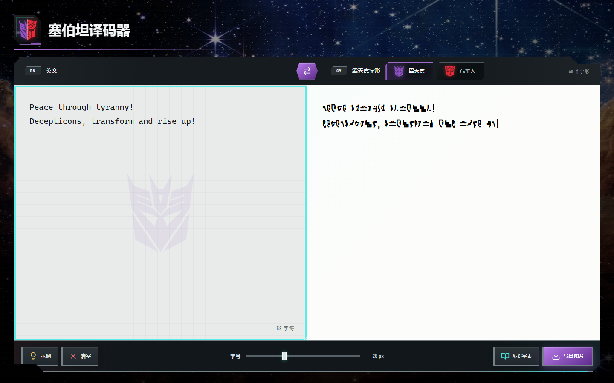
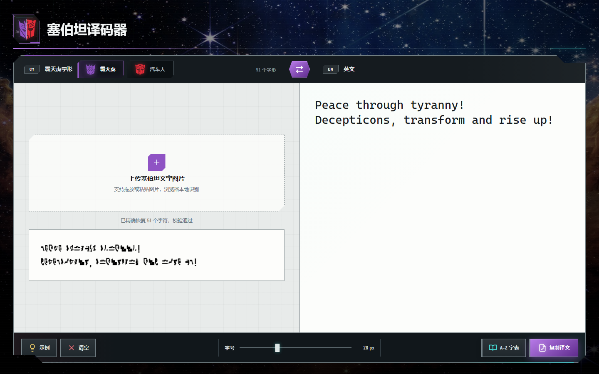
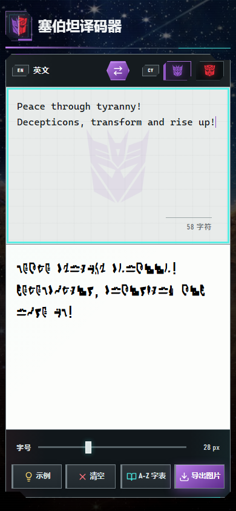
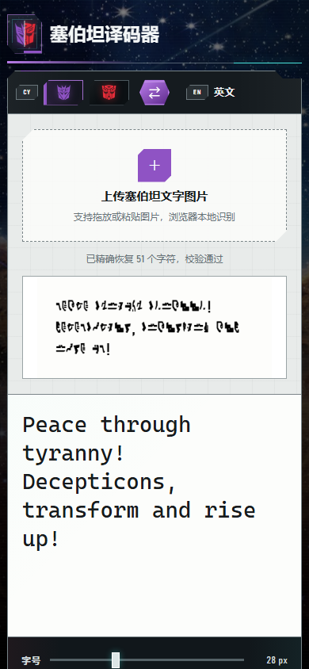
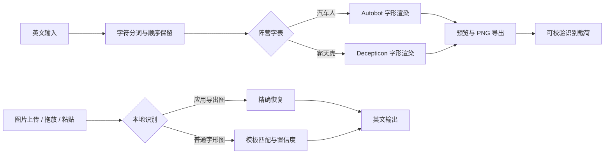

<div align="center">
	
	&nbsp;&nbsp;&nbsp;
	

# 塞伯坦译码器

**一个为《变形金刚》爱好者做的塞伯坦字形转换与识别工具。**

汽车人 / 霸天虎双字形 · 双向翻译 · 本地图片识别 · PNG 导出 · PWA 离线安装

[](https://vite.dev/)
[](https://web.dev/progressive-web-apps/)
[](#测试与质量)
[](#隐私与边界)

</div>

> 我一直很喜欢《变形金刚》作品里那些属于塞伯坦文明的视觉细节。这个项目从一个很朴素的想法开始：如果想用汽车人或霸天虎字形写一句话，能不能不再对着字母表逐个查找？于是有了这个可以直接输入、预览、导出，也可以从图片中识别字形的小工具。

## 字体从哪里来

“塞伯坦文字”首先是《变形金刚》世界观中的视觉设定，用来表现一种来自塞伯坦的文字系统。不同作品和资料中的设计并不总是相同，它也不是一套可以直接等同于现实语言的统一文字标准。

本项目采用的是汽车人和霸天虎两套 A–Z 字形：每个塞伯坦字形分别对应一个拉丁字母。仓库中各整理了 26 个字形素材，并将它们打包成 `cybertron-autobot.woff2` 和 `cybertron-decepticon.woff2` 两套浏览器字体；英文大小写映射到同一个字形。空格、换行和标点会保留，其中标点使用本地 Bahnschrift 或随项目提供的 Gidole DIN 风格字体，以保证阅读和导出效果稳定。

因此，这里的“翻译”更准确地说是**按字母映射进行字形转换**，而不是把英文翻译成另一种有独立语法和词汇的语言。项目所用字体是为网页显示、图片导出和本地识别整理的实现，并不代表官方统一的塞伯坦文字规范。

## 字母对照表

**A–M** · 第一行霸天虎，第二行汽车人

<table align="center">
	<tr>
		<td align="center" bgcolor="#ffffff"><strong>A</strong><br></td>
		<td align="center" bgcolor="#ffffff"><strong>B</strong><br></td>
		<td align="center" bgcolor="#ffffff"><strong>C</strong><br></td>
		<td align="center" bgcolor="#ffffff"><strong>D</strong><br></td>
		<td align="center" bgcolor="#ffffff"><strong>E</strong><br></td>
		<td align="center" bgcolor="#ffffff"><strong>F</strong><br></td>
		<td align="center" bgcolor="#ffffff"><strong>G</strong><br></td>
		<td align="center" bgcolor="#ffffff"><strong>H</strong><br></td>
		<td align="center" bgcolor="#ffffff"><strong>I</strong><br></td>
		<td align="center" bgcolor="#ffffff"><strong>J</strong><br></td>
		<td align="center" bgcolor="#ffffff"><strong>K</strong><br></td>
		<td align="center" bgcolor="#ffffff"><strong>L</strong><br></td>
		<td align="center" bgcolor="#ffffff"><strong>M</strong><br></td>
	</tr>
	<tr>
		<td align="center" bgcolor="#ffffff"><strong>A</strong><br></td>
		<td align="center" bgcolor="#ffffff"><strong>B</strong><br></td>
		<td align="center" bgcolor="#ffffff"><strong>C</strong><br></td>
		<td align="center" bgcolor="#ffffff"><strong>D</strong><br></td>
		<td align="center" bgcolor="#ffffff"><strong>E</strong><br></td>
		<td align="center" bgcolor="#ffffff"><strong>F</strong><br></td>
		<td align="center" bgcolor="#ffffff"><strong>G</strong><br></td>
		<td align="center" bgcolor="#ffffff"><strong>H</strong><br></td>
		<td align="center" bgcolor="#ffffff"><strong>I</strong><br></td>
		<td align="center" bgcolor="#ffffff"><strong>J</strong><br></td>
		<td align="center" bgcolor="#ffffff"><strong>K</strong><br></td>
		<td align="center" bgcolor="#ffffff"><strong>L</strong><br></td>
		<td align="center" bgcolor="#ffffff"><strong>M</strong><br></td>
	</tr>
</table>

**N–Z** · 第一行霸天虎，第二行汽车人

<table align="center">
	<tr>
		<td align="center" bgcolor="#ffffff"><strong>N</strong><br></td>
		<td align="center" bgcolor="#ffffff"><strong>O</strong><br></td>
		<td align="center" bgcolor="#ffffff"><strong>P</strong><br></td>
		<td align="center" bgcolor="#ffffff"><strong>Q</strong><br></td>
		<td align="center" bgcolor="#ffffff"><strong>R</strong><br></td>
		<td align="center" bgcolor="#ffffff"><strong>S</strong><br></td>
		<td align="center" bgcolor="#ffffff"><strong>T</strong><br></td>
		<td align="center" bgcolor="#ffffff"><strong>U</strong><br></td>
		<td align="center" bgcolor="#ffffff"><strong>V</strong><br></td>
		<td align="center" bgcolor="#ffffff"><strong>W</strong><br></td>
		<td align="center" bgcolor="#ffffff"><strong>X</strong><br></td>
		<td align="center" bgcolor="#ffffff"><strong>Y</strong><br></td>
		<td align="center" bgcolor="#ffffff"><strong>Z</strong><br></td>
	</tr>
	<tr>
		<td align="center" bgcolor="#ffffff"><strong>N</strong><br></td>
		<td align="center" bgcolor="#ffffff"><strong>O</strong><br></td>
		<td align="center" bgcolor="#ffffff"><strong>P</strong><br></td>
		<td align="center" bgcolor="#ffffff"><strong>Q</strong><br></td>
		<td align="center" bgcolor="#ffffff"><strong>R</strong><br></td>
		<td align="center" bgcolor="#ffffff"><strong>S</strong><br></td>
		<td align="center" bgcolor="#ffffff"><strong>T</strong><br></td>
		<td align="center" bgcolor="#ffffff"><strong>U</strong><br></td>
		<td align="center" bgcolor="#ffffff"><strong>V</strong><br></td>
		<td align="center" bgcolor="#ffffff"><strong>W</strong><br></td>
		<td align="center" bgcolor="#ffffff"><strong>X</strong><br></td>
		<td align="center" bgcolor="#ffffff"><strong>Y</strong><br></td>
		<td align="center" bgcolor="#ffffff"><strong>Z</strong><br></td>
	</tr>
</table>

## 为什么做这个项目

最初的目标只是让同好可以方便地写名字、短句或纪念文字。继续开发后，我又加入了双阵营切换、PNG 导出、图片回译和离线安装，希望它不只是一张字母对照表，而是一个真的顺手、也愿意反复打开的小工具。

这是一个非官方的粉丝项目。它的目的不是替代任何官方资料，而是把自己喜欢的设定整理成可以使用、可以研究，也方便与其他爱好者分享的形式。

## 应用一览

两个方向在电脑端和手机端使用同一套响应式工作台：正向输入英文并实时生成塞伯坦字形，反向上传字形图片并在本地识别为英文。

### 电脑端

<table width="100%">
	<tr>
		<th width="50%">英文 → 塞伯坦文</th>
		<th width="50%">塞伯坦文 → 英文</th>
	</tr>
	<tr>
		<td width="50%"></td>
		<td width="50%"></td>
	</tr>
</table>

### 手机端

<table width="100%">
	<tr>
		<th width="50%">英文 → 塞伯坦文</th>
		<th width="50%">塞伯坦文 → 英文</th>
	</tr>
	<tr>
		<td width="50%" align="center" valign="top"></td>
		<td width="50%" align="center" valign="top"></td>
	</tr>
</table>

## 能做什么

| 能力 | 说明 |
| --- | --- |
| **双阵营字形** | 在汽车人和霸天虎字母体系间即时切换，预览、字表与导出同步更新 |
| **阵营示例** | “示例”会载入当前阵营的两行标志性语段，并完整保留标点和换行；反向模式会生成对应示例图并立即回译 |
| **英文 → 塞伯坦文** | 输入即翻译；空格、标点、换行和不支持的字符会按原顺序保留 |
| **塞伯坦文 → 英文** | 上传、拖放或粘贴 PNG、JPEG、WebP、GIF 图片，在浏览器中完成本地识别 |
| **无损回译** | 应用导出的 PNG 带有可校验载荷，重新导入时可优先精确恢复原文 |
| **智能识图** | 对普通塞伯坦字形图片使用本地模板识别，并显示置信度与不确定字形 |
| **字号与字表** | 通过滑杆实时调整 16–52 px 字号；随时打开完整 A–Z 阵营字表 |
| **PNG 导出** | 按当前阵营、字号、标点和自动换行布局生成清晰图片 |
| **离线 PWA** | 首次完整加载后缓存核心资源，可安装到桌面或手机主屏幕离线启动 |

## 使用方法

1. **选择字形**：点击“霸天虎”或“汽车人”，切换到对应的字母体系。
2. **开始翻译**：输入英文，或点击“示例”载入当前阵营的标志性语段；点击中间的方向按钮可切换到图片识别模式。
3. **带走结果**：调整字号后导出 PNG；反向模式下则可一键复制识别出的英文。

在图片识别模式中点击“示例”，应用会现场生成当前阵营的塞伯坦文字图片并完成本地回译；上传、拖放和粘贴自有图片的入口仍保留在输入区。

图片识别时，建议使用正视、清晰、对比度较高的字形图片。图片模糊、透视严重或背景复杂时，识别结果中可能出现 `?`。

## 技术路线



项目保持轻量，没有后端服务，也不依赖在线 OCR：

- **Vite 7**：开发服务器、生产构建和静态资源处理。
- **原生 JavaScript**：翻译状态、DOM 渲染、Canvas 导出与交互逻辑。
- **Canvas API**：图片预处理、字形匹配、识别预览和 PNG 生成。
- **vite-plugin-pwa**：Web App Manifest、Service Worker 与离线缓存。
- **Node.js Test Runner + Edge CDP**：单元测试与真实浏览器烟雾测试。

## 本地开发

### 环境要求

- Node.js `20.19+` 或 `22.12+`
- npm `10+`
- 浏览器烟雾测试需要 Windows 上安装 Microsoft Edge

### 启动项目

```powershell
git clone <你的仓库地址>
cd <仓库目录>
npm install
npm run dev
```

Vite 会在终端打印本地访问地址。保存代码后页面会自动热更新。

生产构建与本地预览：

```powershell
npm run build
npm run preview
```

### 常用命令

| 命令 | 用途 |
| --- | --- |
| `npm run dev` | 启动可供局域网访问的 Vite 开发服务器 |
| `npm test` | 运行翻译器与识别器单元测试 |
| `npm run build` | 生成生产构建到 `dist/` |
| `npm run preview` | 本地预览生产构建 |
| `npm run check` | 依次运行单元测试和生产构建 |
| `npm run test:browser` | 启动真实 Edge 会话，执行端到端烟雾测试 |

## 项目结构

```text
.
├── index.html                 # PWA 入口与无障碍语义结构
├── app/
│   ├── app.js                 # 页面状态、交互、渲染与 PNG 导出
│   ├── translator.js          # 字表注册、方向定义与字符分词
│   ├── recognizer.js          # 本地图片识别与可校验载荷
│   ├── styles.css             # 响应式视觉系统
│   └── assets/                # 字体、阵营徽标与 A–Z 字形素材
├── public/icons/              # PWA 与 Apple Touch 图标
├── docs/screenshots/          # README 使用的真实应用截图
├── tests/                     # 单元测试与浏览器烟雾测试
├── vite.config.js             # Vite / PWA 构建配置
└── package.json               # 项目脚本与开发依赖
```

## 测试与质量

日常提交前运行：

```powershell
npm run check
```

需要验证完整交互、响应式布局、字体加载、图片导出和反向识别时运行：

```powershell
$env:BROWSER_SMOKE_COMPACT='1'
npm run test:browser
Remove-Item Env:BROWSER_SMOKE_COMPACT
```

浏览器烟雾测试覆盖 `1440 × 900`、`1366 × 768`、`430 × 932`、`390 × 844` 与 `320 × 720` 等视口，并检查横向溢出、控件重叠、阵营切换、A–Z 字表、PNG 下载以及导出图回译。

## 安装为应用

- **Windows / macOS / Android**：使用 Chrome 或 Edge 打开部署地址，点击地址栏安装图标，或在浏览器菜单中选择“安装应用”。
- **iPhone / iPad**：使用 Safari 打开部署地址，点击“分享” → “添加到主屏幕”。

首次完整打开后，核心资源会缓存到设备。iOS Safari 不会自动弹出安装提示，需要通过分享菜单手动添加。

## 部署到 GitHub Pages

1. 将默认分支设为 `main` 并推送代码。
2. 进入仓库 **Settings → Pages → Build and deployment**。
3. 将 **Source** 设为 **GitHub Actions**。
4. 在 **Actions** 中等待 **Deploy PWA to GitHub Pages** 工作流完成。
5. 访问 `https://<用户名>.github.io/<仓库名>/`。

构建使用相对资源路径，无需把仓库名写死在配置中，因此也适用于项目级 GitHub Pages 子路径。

## 隐私与边界

所有字形转换、图片解析与识别都在当前浏览器内完成；应用不上传文本或图片，也不需要账号和 API Key。浏览器测试还会断言运行期间没有外部网络请求。

本项目识别的是随仓库提供的汽车人 / 霸天虎字形体系，并非通用 OCR，也不能保证识别其他《变形金刚》作品中出现的所有文字设计。被裁切、旋转、强透视或严重压缩的图片需要先做适当整理。

《变形金刚》、汽车人、霸天虎及相关标志属于其各自权利方。本项目为非官方、非商业的爱好者作品，相关元素仅用于主题识别与学习交流。